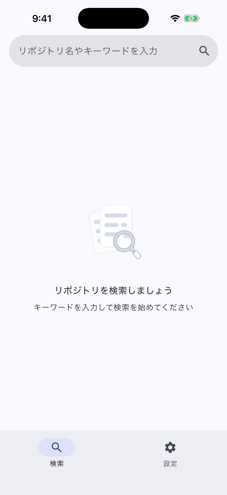
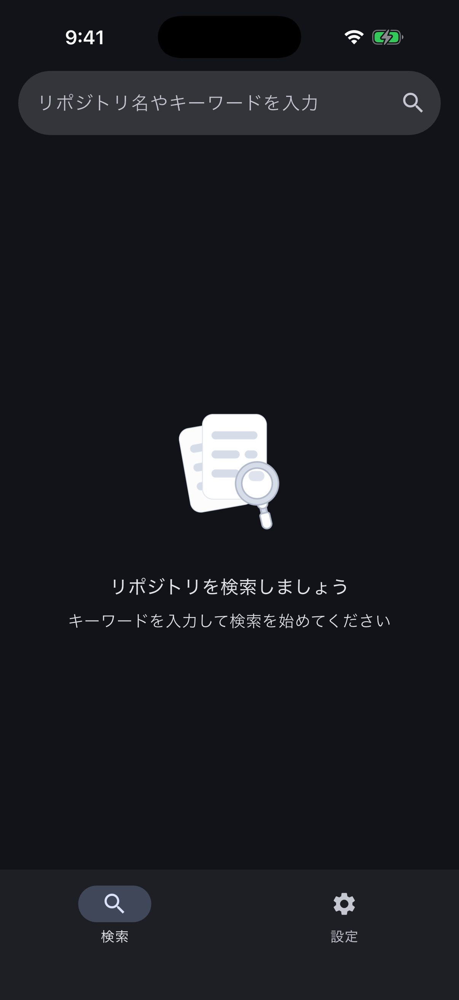
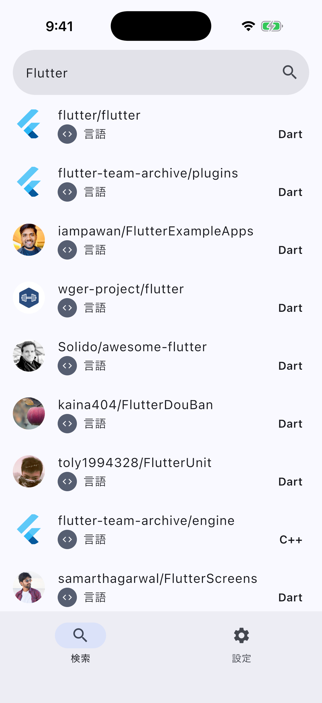
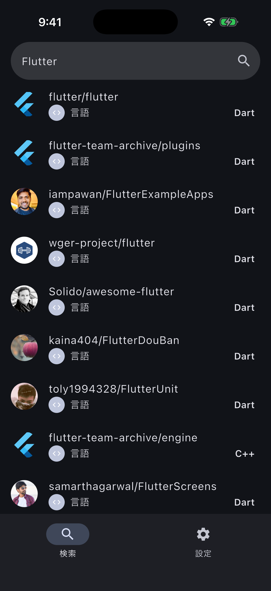
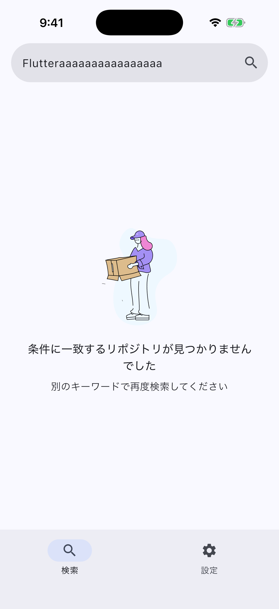
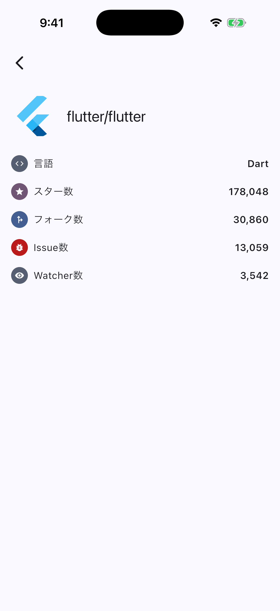
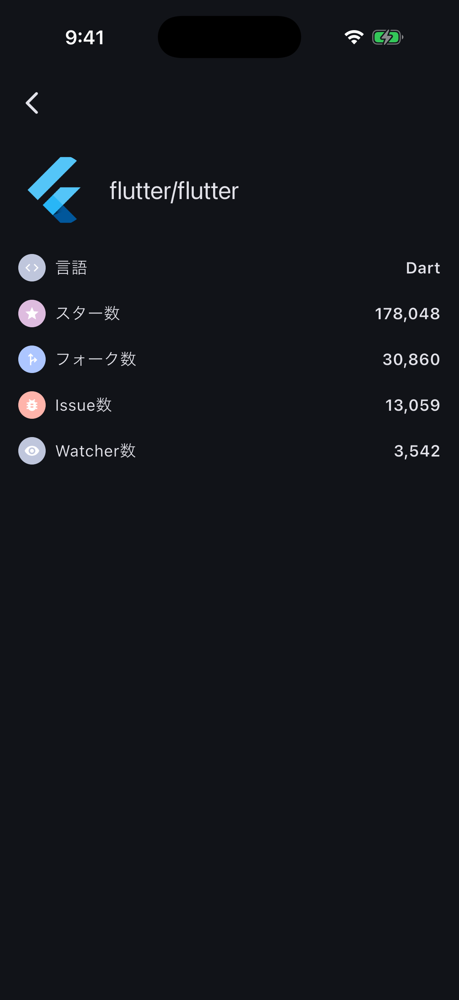
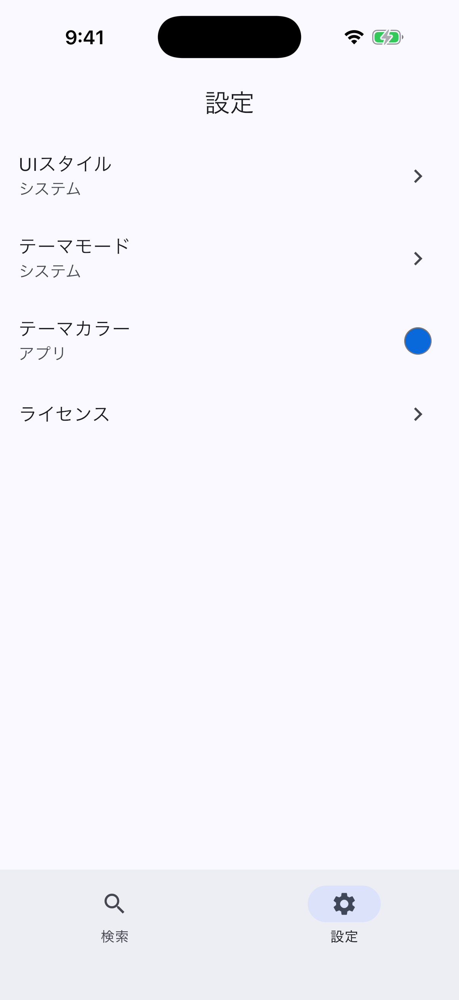
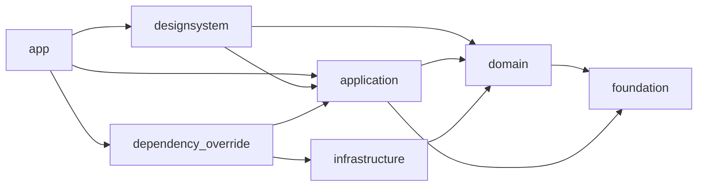

# material GitHub Searcher

<!-- cspell:words designsystem yumemi codecheck subscribers stargazers IPHONEOS -->

[ゆめみ Flutter エンジニアコードチェック](https://github.com/yumemi-inc/flutter-engineer-codecheck)への提出用に、GitHubのリポジトリをキーワード検索できるMaterial Design 3準拠のFlutterアプリを実装した。
本READMEは初見のレビュアーが、setup・実行・test・設計判断をこのファイルだけから辿れることを目的にしている。詳細な理由・手順は各`docs/*.md`にリンクする。

## スクリーンショット

未検索時と検索結果0件時のLottieは意味が異なる（前者は「まだ検索していない」案内、後者は「検索した結果0件だった」案内）。一覧はRepository名・owner icon・言語のみを表示し、Starはタップ後の詳細画面に表示する。

<table>
<tr><th>画面</th><th>Light</th><th>Dark</th></tr>
<tr>
<td>未検索（初期状態）</td>
<td></td>
<td></td>
</tr>
<tr>
<td>検索結果一覧</td>
<td></td>
<td></td>
</tr>
<tr>
<td>検索結果0件</td>
<td></td>
<td>-</td>
</tr>
<tr>
<td>リポジトリ詳細</td>
<td></td>
<td></td>
</tr>
<tr>
<td>Settings</td>
<td></td>
<td>-</td>
</tr>
</table>

## 対応プラットフォーム

Android/iOSを正式対象とする。Webは正式配布対象ではなく、Device Previewやローカルでの動作確認用途として維持する（[GitHub Pagesで公開中](https://yakitama5.github.io/material_github_searcher/)）。Windows・macOS・Linux runnerは対象外のため意図的に削除した（詳細は[`docs/development.md`](docs/development.md)）。

## ゆめみ必須要件との対応

| 要件 | 対応内容 |
| --- | --- |
| IDE・SDK・言語は基本的に最新の安定版を利用 | Flutter 3.44.8 / Dart 3.12.2を`mise.toml`で固定し、全開発者・CIで同一バージョンを使用する。アップグレード手順は[`docs/flutter-upgrade.md`](docs/flutter-upgrade.md) |
| 最新の安定版以外を使う場合は理由を記載 | 該当なし（IDE・SDK・言語は最新安定版を使用） |
| 状態管理はProvider/Riverpodのいずれか | Riverpod（generatorを使わず手書き）を採用。理由は[`docs/ARCHITECTURE.md`](docs/ARCHITECTURE.md) |
| サードパーティライブラリはOSSに限り制限なし | dio・go_router・riverpod・lottie・animations・dynamic_color・slang・shared_preferences等、pub.dev公開のOSSのみ使用 |
| 対象OSバージョンはFlutterプロジェクト作成時点のバージョン | Androidは`flutter.minSdkVersion`/`targetSdkVersion`/`compileSdkVersion`を上書きせずFlutterの既定値のまま使用。iOSは`IPHONEOS_DEPLOYMENT_TARGET`をPodfile既定の`13.0`のまま使用 |
| キーワードを入力できる | 送信式SearchBar（`RepositorySearchBar`）。入力だけでは検索せず、送信操作で確定する |
| 入力したキーワードでGitHubのリポジトリを検索できる | [下記「機能」](#機能)参照 |
| `search/repositories`を利用し、`github`パッケージ等を使わず自前実装 | `packages/infrastructure/github`が`dio`のみで自前実装（[下記「API・挙動として明記する事項」](#api挙動として明記する事項)参照） |
| 検索結果は一覧で概要（リポジトリ名）を表示 | 一覧はRepository名・owner icon・言語を表示（要件のリポジトリ名表示を満たした上で#136の判断により拡張） |
| タップで詳細（リポジトリ名・オーナーアイコン・言語・Star数・Watcher数・Fork数・Issue数）を表示 | `RepositoryDetailPage`で6項目を表示。Watcherのみ`subscribers_count`を非同期取得する |
| マテリアルデザインに準拠 | Material Design 3（`useMaterial3`既定）+ Dynamic Color対応。方針は[`docs/design.md`](docs/design.md) |

## 機能

- **検索**: 送信式のSearchBarにキーワードを入力し、送信（キーボードの検索ボタンまたは虫眼鏡アイコン）で検索を実行する。入力中の絞り込みは行わない。
- **検索履歴**: 送信した検索の成否・0件に関わらずキーワードを記録する。最大10件、重複は先頭へ移動、全削除は確認ダイアログを挟む。
- **pagination**: 一覧を末尾までスクロールすると次ページ（1ページ30件）を自動取得する。
- **Pull to Refresh**: 指で引いている間はIndicatorが静止した図形のまま追従し、release後に発火するrefresh中だけMaterial 3の回転アニメーションになる（`M3RefreshIndicator`）。
- **詳細画面**: 検索結果一覧の要約（名前・owner icon・言語・Star・Fork・Issue）を初回frameから即時表示し、実Watcher数（`subscribers_count`）だけ非同期取得してSkeleton→値へ差し替える。詳細画面はOpenContainerの内部Routeとして開く（下記の既知の制約を参照）。
- **Skeleton / 初期案内 / 0件案内**: 読み込み中は`SkeletonScope`ベースの共通Skeletonを表示する。未検索時と検索結果0件時は、それぞれ専用のLottieアニメーションで案内する（意味が異なるため共通化しない）。
- **エラー・cancel**: 通信失敗時はエラー表示とRetryを提供する。通信中に画面遷移・タブ切り替えを行うと通信をキャンセルする。
- **Theme**: UI Style（system/android/ios）・ThemeMode（system/light/dark）・ThemeColor（アプリSeed色 or OS Dynamic Color）を設定画面から変更できる。設定はSharedPreferencesへ永続化する。
- **License**: 設定画面からFlutter標準の`LicensePage`を開き、アプリ自身のMITライセンスと依存パッケージのライセンス一覧を確認できる。
- **多言語対応**: 日本語・英語（`slang`によるSSOT管理）。
- **Flavor**: Dev/Prodでアプリ名・Application ID・ランチャーアイコンを切り替える。

## Architecture

オニオンアーキテクチャに沿ってレイヤーを分離し、内側から外側への依存を禁止する。画面固有のViewModelは置かず、Riverpodの手書きProviderをアプリ状態のSingle Source of Truthとする。GitHub APIから取得した結果は、UIが独自に加工した状態を持たず単方向にRiverpod Providerへ流れる。



| パッケージ | 責務 |
| --- | --- |
| `packages/domain` | エンティティ、値オブジェクト、リポジトリ抽象、業務ルール |
| `packages/application` | ユースケース、アプリ状態、Riverpod Provider（generator不使用の手書き） |
| `packages/infrastructure/*` | GitHub API（`github`）・SharedPreferences（`shared_preferences`）・テスト用Mock（`mock`）の実装 |
| `packages/designsystem` | テーマ、共通Widget（Skeleton、Refresh Indicator等） |
| `packages/dependency_override` | applicationのProviderとinfrastructureの実装の結線 |
| `packages/foundation` | ドメインに依存しない汎用ユーティリティ |
| `apps/app` | 画面、go_routerによるAdaptive App Shell、composition root |

ナビゲーションは`go_router`の`StatefulShellRoute`で検索・設定の2ブランチを管理し、画面幅（compact/medium/expanded）に応じて`NavigationBar`と`NavigationRail`を切り替えるAdaptive Shellを構成する。詳細は[`docs/ARCHITECTURE.md`](docs/ARCHITECTURE.md)、依存性逆転の機械的検査・Pub Workspace運用も同ドキュメントを参照。デザイン方針（レスポンシブブレークポイント等）は[`docs/design.md`](docs/design.md)を参照。

## Setup・実行・build

このリポジトリは[mise](https://mise.jdx.dev/)でFlutter/Dartのバージョンを固定管理している。

```sh
mise install
mise exec -- dart tools/sync_sdk_versions.dart --check
mise exec -- flutter pub get
```

```sh
cd apps/app

# Dev (Android)
mise exec -- flutter run --flavor dev --dart-define-from-file=flavor/dev.json

# Prod (Android)
mise exec -- flutter run --flavor prod --dart-define-from-file=flavor/prod.json

mise exec -- flutter test
```

iOSはSimulator ID指定・Scheme選択が必要、buildコマンドやアプリアイコン生成手順も含めた全コマンドは[`docs/development.md`](docs/development.md)を参照。

### Device Preview（Dev Web限定）

端末サイズ・画面向き・Text Scale・Light/Darkを素早く確認するための専用entrypoint。通常のDev/Prod起動、Widget Test、Patrolには影響しない。

```sh
cd apps/app
mise exec -- flutter run -d chrome -t debug/main.dart --dart-define-from-file=flavor/dev.json
```

`main`へのpushで[GitHub Pagesへ自動デプロイ](https://yakitama5.github.io/material_github_searcher/)される。詳細・制約は[`docs/development.md`](docs/development.md#device-previewdev-web限定)を参照。

## テスト・CI

| パッケージ | テスト種別 |
| --- | --- |
| `domain` / `application` / `infrastructure/*` | Unit Test |
| `designsystem` | Widget Test / Golden Test |
| `apps/app` | Widget Test |
| 主要ユーザーフロー | E2E Test（Patrol） |

```sh
# 純粋なDartパッケージ
cd packages/domain && mise exec -- dart test

# Flutterパッケージ・アプリ
cd apps/app && mise exec -- flutter test
```

PRのRequired Status Check（`check_pr.yaml`）はFormat・Analyze・Unit/Widget Test・パッケージ依存検査・cspell・markdownlintを対象にする。Golden Test（OS間の描画差により決定的に比較できないため）とPatrol E2E（実機・Simulatorが必要で実行時間もかかるため）はCI対象外とし、ローカル実行に限定する。

```sh
cd packages/designsystem
flutter test --tags=golden       # Golden Testのみ（コミット前にローカルで実行）

# リポジトリルートで実行
mise run test:e2e <Android端末IDまたはiOS Simulator ID>
```

背景・Fake/Mockの方針・画面幅ごとのWidget Testの書き方は[`docs/testing.md`](docs/testing.md)を参照。

## API・挙動として明記する事項

- `search/repositories`を[`github`パッケージ](https://pub.dev/packages/github)を使わず、`dio`で自前実装した（`packages/infrastructure/github`）。
- 認証なしの公開APIを利用し、秘密鍵は埋め込んでいない。
- 1ページ30件、`sort`/`order`は指定せずBest Match順、GitHub Search APIの上限である1000件に達すると次ページを要求しない。
- Watcher数はDetail API（`GET /repos/{owner}/{repo}`）の`subscribers_count`を使う。`watchers_count`はStar数相当のため、Watcher表示には使わない。
- Starは一覧では表示せず、詳細画面にのみ表示する。
- `open_issues_count`にはPull Requestも含まれる（GitHub API自体の仕様）。
- 検索履歴は最大10件。送信のたびにtrim・重複は先頭へ移動、全削除は確認ダイアログを挟む。
- 詳細画面はOpenContainerの内部Routeとして開くため、go_router管理外でDeep Link対象外。
- 通信中に詳細画面を閉じる・検索タブから離脱すると、進行中の通信をキャンセルする。
- 詳細画面の取得成功結果は、最後のlistenerが外れてから5分間cacheする。errorとcancelの結果はcacheしない。
- [envied](https://pub.dev/packages/envied)は認証を導入するまで採用していない。
- SharedPreferencesのキーは各Repository実装（adapter）内のprivate constで管理し、現時点では共通Enumを導入していない。
- Device PreviewのlocaleはSlangのlocale設定と二重管理せず、Device Preview側の切り替え対象から外している。

## 実行・検証環境

| 項目 | 値 |
| --- | --- |
| Flutter / Dart | 3.44.8 / 3.12.2（`mise.toml`で固定） |
| 開発機OS | macOS 26.6 |
| iOS 実検証環境 | iPhone 17 Pro Simulator（iOS 26.1） |
| Android 実検証環境 | Pixel 8a 実機（Android 17 / API 37） |
| iOS物理端末 | 未検証（署名・Provisioning Profileの運用が必要なため対象外。詳細は[`docs/development.md`](docs/development.md)） |

## AIサービスの利用について

本プロジェクトはClaude Code／Codexをはじめとするコーディングエージェントを積極的に活用して開発した。

- `.agents/skills/`配下に、コミット・PRレビューレポート作成等の再利用可能なスキルを定義し、Claude CodeとCodexの両方から同じ定義を参照する（ツール固有ディレクトリはシンボリックリンクで実体を共有）。
- 推奨開発フロー（プラン作成→実装→Draft PR作成→詳細レビュー→レビュー依頼）は[`docs/agent-driven-development.md`](docs/agent-driven-development.md)にまとめている。
- 実装判断の理由・背景は`docs/technical-decisions.md`に人手で記録し、エージェントには編集させていない。
- コード中のコメントは「なぜ」を記録する目的に絞り、エージェントが実装と同時に背景（設計上の制約・過去に踏んだ罠等）を書き残す運用にしている。

## 既知の制約

- GitHub Search APIは未認証アクセスのため、レート制限（分単位）にかかりやすい。レート制限時は専用のエラーメッセージを表示する。
- Golden TestはOS間の描画差により決定的に比較できないためCI対象外（ローカル実行のみ）。
- Patrol E2E TestはRequired Status Checkに含めず、ローカル実行のみ（実行環境は上記「実行・検証環境」を参照）。
- iOS物理端末では未検証（上記「実行・検証環境」を参照）。
- Device Preview（Dev Web限定）はlocale切り替えを対象外にしている（Slangとの二重管理を避けるため）。

## License

This project is licensed under the MIT License - see the [LICENSE](LICENSE) file for details.
