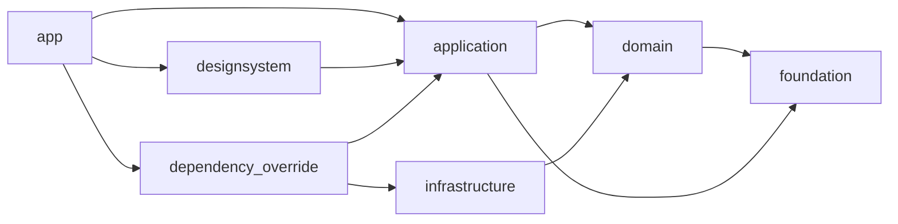

# アーキテクチャ

<!-- cspell:words designsystem -->

本プロジェクトは、Dart 標準の Pub Workspace で複数パッケージを管理し、
オニオンアーキテクチャの依存性逆転に沿って責務を分離する。
内側のレイヤーから外側のレイヤーを import してはならない。

## パッケージ構成と依存関係



| パッケージ | 責務 |
| --- | --- |
| `packages/domain` | エンティティ、値オブジェクト、リポジトリ抽象、業務ルール。Flutter や外部 I/O に依存しない |
| `packages/application` | ユースケース、アプリ状態、リポジトリ抽象を注入する Provider |
| `packages/infrastructure/*` | API やローカルストレージなど、外部サービスを利用するリポジトリ実装 |
| `packages/designsystem` | テーマ、共通 Widget、画面に依存しない UI 表現 |
| `packages/dependency_override` | application の Provider と infrastructure の実装の結線 |
| `packages/foundation` | ロガーなど、ドメインに依存しない汎用ユーティリティ |
| `apps/app` | 画面、ルーティング、ローカライズ、composition root |

矢印はパッケージの依存方向を表す。`domain` は Dart のみで構成し、Flutter、
状態管理ライブラリ、外部 I/O に依存させない。`foundation` も特定のドメインや
Flutter に依存させず、複数レイヤーから利用できる純粋なユーティリティに限定する。
図にない依存は追加しない。`designsystem` から `application` への依存は、アプリ状態を
参照する共通 UI に限定し、`domain`、`infrastructure`、`dependency_override`、`app` を
直接参照させない。

## Pub Workspace を利用する方針

本プロジェクトでは Melos を使わず、ルート `pubspec.yaml` の `workspace:` と、
各パッケージの `pubspec.yaml` の `resolution: workspace` による Dart 標準の
Pub Workspace のみで運用する。

現状は Flutter の雛形だけで、複数パッケージを横断するテストやコード生成の対象が
存在しない。バージョン統一や `melos exec` による一括処理を導入しても、現時点では
運用コストに見合わないためである。複数パッケージでテストや `build_runner` による
コード生成が必要になった時点で、Melos の導入または単純なシェルスクリプトによる
代替を再検討する。

この判断には次の影響がある。

- CI ワークフローでは `melos run` を使わず、`dart analyze`、`flutter test`、
  `npx` などのコマンドを直接実行する。
- CI ワークフローはチェック内容ごとに専用ファイルへ分ける。並列開発時のファイル
  競合を避けるため、複数のチェックを単一ファイルへ集約しない。
- 依存バージョンは Melos の bootstrap では統一しない。各パッケージの
  `pubspec.yaml` に、利用するバージョンを `any` やキャレット付きの範囲ではなく
  個別の固定バージョンで明記する。SDK 制約は Pub の仕様に従いつつ、実際に使う
  Flutter と Dart のバージョンを `mise.toml` で固定する。

### SDK制約の同期

`mise.toml` をFlutter/Dart SDKバージョンの唯一の正とする。ルートと全Workspace
メンバーの `environment.sdk`、およびFlutter SDK依存を持つメンバーの
`environment.flutter` は、次のツールで演算子なしの完全一致へ同期する。

```sh
mise exec -- dart tools/sync_sdk_versions.dart
```

手作業で各 `pubspec.yaml` を更新しない。CIでは依存解決より先に `--check` を実行し、
`mise.toml` との不一致やFlutter利用パッケージの指定漏れを検出する。

## パッケージ命名規則

パッケージ名に `packages_` 接頭辞は付けず、責務を表す snake_case の名前に統一する。
`packages` 配下のトップレベルパッケージ名はディレクトリ名と一致させ、`foundation`、
`domain`、`application`、`designsystem`、`dependency_override` とする。`apps/app` は
既存アプリの移動先であるため、パッケージ名 `material_github_searcher` を維持する。

`packages/infrastructure/<adapter>` 配下のパッケージは、複数のアダプターを区別できる
ように `infrastructure_<adapter>` と命名する。たとえば
`packages/infrastructure/mock` のパッケージ名は `infrastructure_mock` とする。
将来 GitHub API 用のアダプターが必要になった場合は、
`packages/infrastructure/github` と `infrastructure_github` の組み合わせで追加する。

## 依存性逆転と実装の結線

リポジトリのインターフェースは `domain` に置き、その実装を
`packages/infrastructure/*` に置く。`application` は `domain` の抽象だけに依存し、
具体的な外部サービスを認識しない。

結線には参考リポジトリと同じく、独立した `dependency_override` パッケージを使う。
このパッケージだけが `application` の Provider と `infrastructure` の実装の両方を
参照し、実装を注入するための override を公開する。`apps/app` は composition root で
その override を適用する。これにより、アプリやユースケースを変更せずにモックと
実サービスを切り替えられ、結線の詳細も画面コードから分離できる。

## 最初に用意する infrastructure

最初は `packages/infrastructure/mock` のみを用意する。機能が未実装の段階では
実 API の仕様や永続化方式が確定していないため、GitHub API クライアントや
ローカルストレージのパッケージを先行して作らない。

Issue #20 の初期構築では `infrastructure_mock` を Pub Workspace に参加させ、上記の
依存方向を表す最小構成に留める。リポジトリ抽象が追加された後、その抽象を満たす
テスト・開発用実装をここへ追加する。実 API や永続化が必要になった時点で、外部 I/O
ごとに `packages/infrastructure/<adapter>` を追加する。
